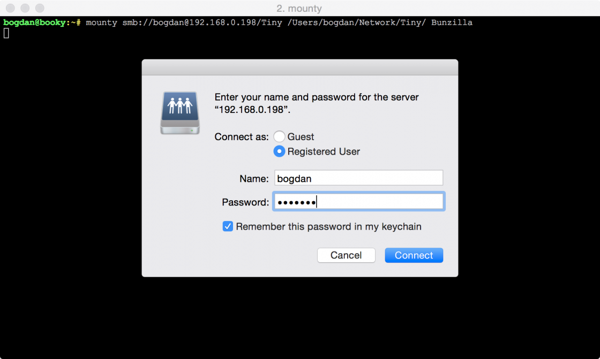

# Mounty 2



Mounty 2 is a clean rewrite of [Mounty](https://github.com/x0054/mounty) in Swift. This version of Mounty also concentrates on a slightly different use case, namely automating mounting Samba shares in command line on MacOS while safely storing passwords.

## Problem

Imagine you have a Samba (Windows File Server) share that you need to mount on your Mac periodically, and you would like to mount the share with a command line script, but for security reasons you don't want to repeatedly type in the share password on the command line or store the password in a script.

## Solution

The standard MacOS mount command doesn't play nice with **MacOS's Keychain**, but Mounty does! And it's super simple to use in a shell script. Try it out!

## Usage

This command will attempt to mount the share located at `smb://server/share` with credentials for user `user` and the password stored in the **MacOS Keychain** for that user inside the folder specified as `/mount/point`.

```
mounty smb://user@server/share /mount/point
```

If the Keychain doesn't have the password for the user, the OS will prompt the user to enter and save the password.

In some cases it is useful to only attempt to connect to a given share if you are connected to the right WiFi network. This is especially useful in my consulting work. To help with this Mounty takes an optional 3rd argument of `WiFi_SSID` and will only attempt the connection if the system is currently connected to the specified SSID.

```
mounty smb://user@server/share /mount/point WiFi_SSID
```

## Installation

To install the command line tool compile it from source or grab it from releases, and place it in your path. You can do so by running the following:

```
wget https://github.com/x0054/mounty2/releases/download/1.0/mounty -O /usr/local/bin/mounty
chmod 755 /usr/local/bin/mounty
```

## File System Integration

Sometimes it's just easier to point and click. For these instances Mounty has a little helper app created in Automator. Using it is simple.

1. Download [mounty-v1.0-with-helper.zip](https://github.com/x0054/mounty2/releases/download/1.0/mounty-v1.0-with-helper.zip) from releases. Unzip and install the helper app by dragging Mounty.app to your `Applications` directory.
2. Create an empty directory where you would like to mount you remote share.
3. Place in the empty directory a text file with an extension of `.mount`. Something like `share.mount` would work well.
4. Edit the `share.mount` file an on the first line enter the share location like so `smb://user@server/share`.
5. (You only need to do this ones) Right click on the new `share.mount` file and click "Get Info". In the popup window, in the "Open with" section, select Mounty helper app from the drop down menu and then click "Change All..." button underneath.
6. Now simply double click the `share.mount` file. You will see a spinning gear in the menu bar, and shortly your share will be mounted inside the folder where `share.mount` file was located.

*Note: You will be kicked out of the folder as soon as it's mounted. Don't worry, your `share.mount` file isn't gone, it's simply hidden by the contents of the mounted share. As soon as you unmount the share, you will see the `share.mount` file again.*

